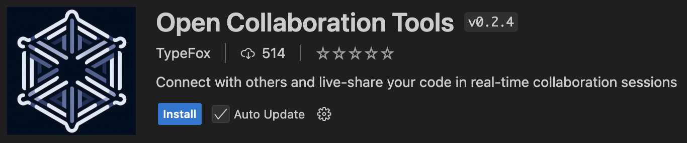
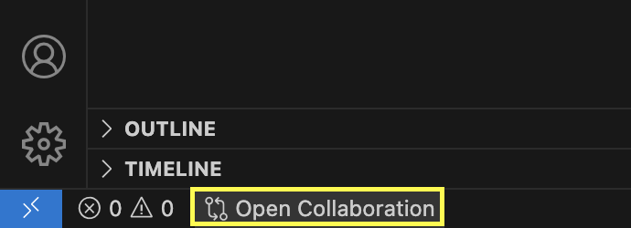
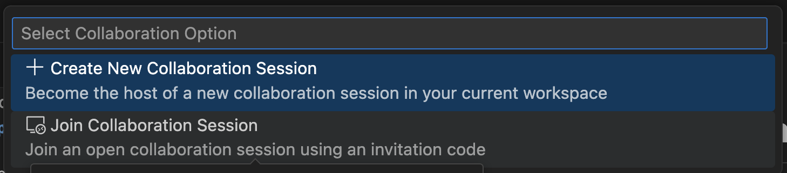

# Participating in the Dojo

All you need to join is a GitHub account.
We use [Open Collaboration Tools](https://www.open-collab.tools/) to collaborate real time in an online IDE

## First time setup

1. Go to https://vscode.dev/ (or feel free to use vscode locally if you prefer)
2. Go to `Extensions`
3. Search for and install Open Collaboration Tools
   

## Joining a session

1. You should now have a small "Open Collaboration" widget at the bottom right of vscode
   
2. This opens a pop up, choose "Join Collaboration session"
   
3. Paste in an invitation code that will be posted in the discord
4. Open collab tools will prompt you to login
5. Wait for the host to approve your request and you're in!
